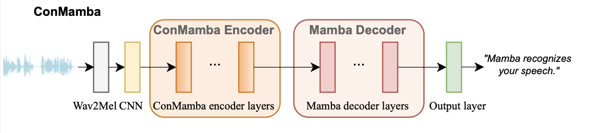
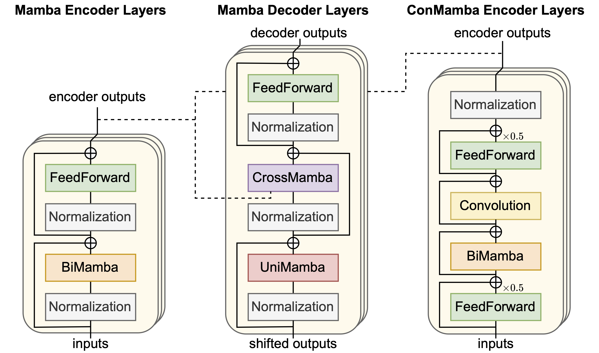
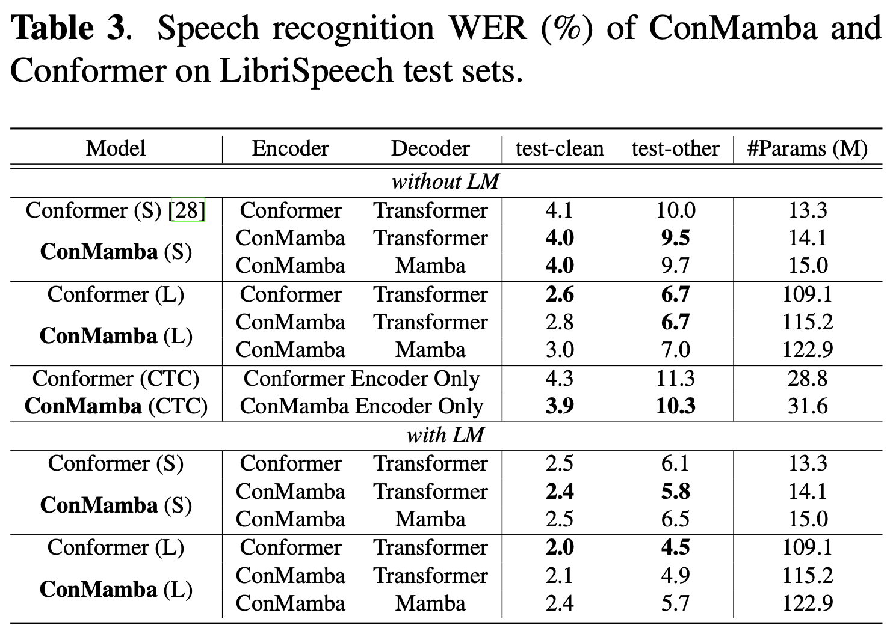

# ConMamba

An official implementation of convolution-augmented Mamba speech recognition model.

[](https://arxiv.org/abs/<INDEX>)

## Architecture




## Prerequisites

```
conda create --name Slytherin python=3.9
conda activate Slytherin
pip install -r requirements.txt
```
You may need to install lower or higher versions of torch, torchaudio, causal-conv1d and mamba-ssm based on your hardware and system. Make sure they are compatible. 


## Training
To train a ConMamba Encoder-Transformer Decoder model on one GPU:
```
python train_S2S.py hparams/S2S/conmamba_large(small).yaml --data_folder <YOUR_PATH_TO_LIBRISPEECH> --precision bf16 
```
To train a ConMamba Encoder-Mamba Decoder model on one GPU:
```
python train_S2S.py hparams/S2S/conmambamamba_large(small).yaml --data_folder <YOUR_PATH_TO_LIBRISPEECH> --precision bf16 
```
To train a ConMamba Encoder model with a character-level CTC loss on four GPUs:
```
torchrun --nproc-per-node 4 train_CTC.py hparams/CTC/conmamba_large.yaml --data_folder <YOUR_PATH_TO_LIBRISPEECH> --precision bf16 
```

## Performance


## Acknowledgement

We acknowledge the wonderful work of [Mamba](https://arxiv.org/abs/2312.00752) and [Vision Mamba](https://arxiv.org/abs/2401.09417). We borrowed their implementation of [Mamba](https://github.com/state-spaces/mamba) and [bidirectional Mamba](https://github.com/hustvl/Vim). The training recipes are adapted from [SpeechBrain](https://speechbrain.github.io).

## Citation
If you find this work helpful, please consider citing:


You may also like our Mamba for speech separation: https://github.com/xi-j/Mamba-TasNet

